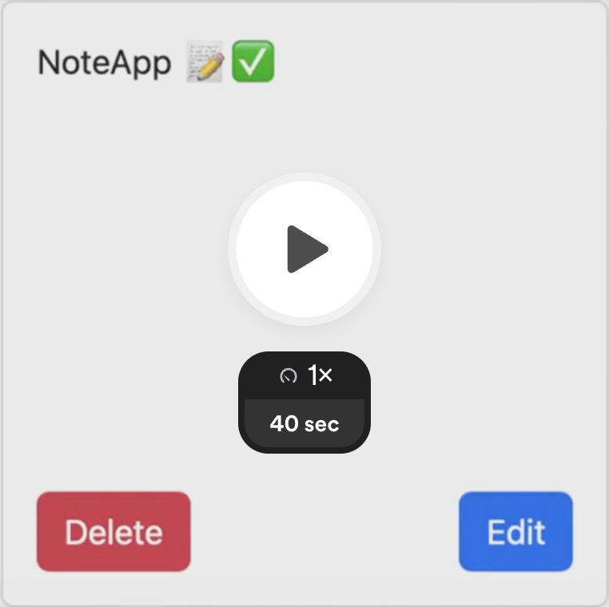

# NoteApp :memo:

NoteApp is a Spring Boot application for creating, editing and viewing notes and todos.

## Project Demo

## Features

1. Displaying notes.
2. Creating new notes.
3. Deleting existing notes.
4. Editing existing notes.
5. User Authentication: Register and Login.

## Technologies Used

### Frontend
* JavaScript
* HTML
* CSS
* Bootstrap

### Backend
* Java
* Spring Boot
* PostgreSQL
